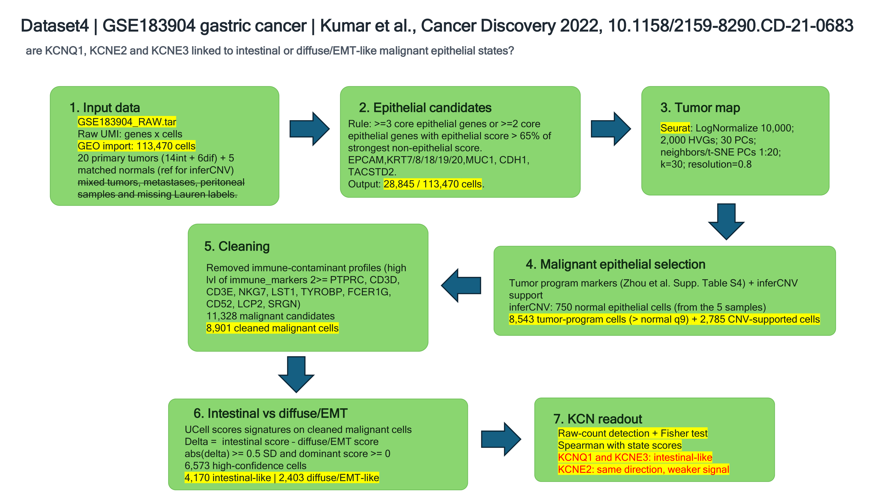

# GSE183904 gastric cancer KCN analysis

This repository contains a single-cell RNA-seq analysis of gastric cancer epithelial states.

The question is simple: are **KCNQ1**, **KCNE2** and **KCNE3** more linked to intestinal-like malignant epithelial cells, or to diffuse/EMT-like malignant epithelial cells?

The work was done during a six-month Master 1 bioinformatics internship in the **Regulations of Ion Channel in Cancer** laboratory. The team studies how ion channels contribute to cancer biology, with projects focused on PDAC and gastric cancer. The laboratory is part of Universite Cote d'Azur and affiliated with CNRS and Inserm: UMR 7277 CNRS, U 1091 Inserm, tutelle Universite Cote d'Azur UniCA.

## Dataset

The analysis uses the author-processed raw count matrices from **GSE183904**.

Source paper:

Kumar V. et al. *Single-Cell Atlas of Lineage States, Tumor Microenvironment, and Subtype-Specific Expression Programs in Gastric Cancer*. Cancer Discovery, 2022. DOI: [10.1158/2159-8290.CD-21-0683](https://doi.org/10.1158/2159-8290.CD-21-0683)

Only primary tumors with an available intestinal or diffuse Lauren diagnosis were kept, together with their matched normal epithelial samples for the inferCNV reference.

## Pipeline



The pipeline keeps the analysis close to the biological question.

1. Start from the raw UMI count matrices.
2. Keep broad epithelial candidates using epithelial marker expression.
3. Recluster epithelial candidates with Seurat.
4. Select malignant epithelial cells with tumor-program markers and inferCNV support.
5. Remove clear immune-contaminant profiles.
6. Score intestinal and diffuse/EMT programs with UCell.
7. Keep high-confidence cells.
8. Test KCN detection and association with the two state scores.

Final high-confidence set:

- **6,573 malignant epithelial cells**
- **4,170 intestinal-like cells**
- **2,403 diffuse/EMT-like cells**

## Main result

KCNQ1 and KCNE3 are mainly oriented toward the intestinal-like state.

KCNQ1 is detected in 25.7% of intestinal-like cells and 1.7% of diffuse/EMT-like cells. KCNE3 is detected in 28.2% of intestinal-like cells and 5.7% of diffuse/EMT-like cells. Fisher exact tests support these detection differences.

KCNE2 follows the same direction, but the signal is weaker. It is less stable in the within-patient association analysis.

These results support a transcriptomic association. They do not prove channel activity or causality.

## Additional KCNQ1 Lauren-level check

A second, simpler analysis was added for KCNQ1 only. It follows the Lauren diagnosis at the sample level and compares epithelial cells from:

- primary normal gastric samples
- intestinal-type primary tumors
- diffuse-type primary tumors

Because the groups have different cell numbers, the comparison was repeated after random downsampling to `3,368` cells per group. The main readout is detection rate, defined as the fraction of cells with raw KCNQ1 count `> 0`.

This analysis supports the expected direction:

```text
Primary normal epithelial > intestinal-type tumor > diffuse-type tumor
```

Main outputs:

- `outputs/final/kcnq1_lauren_downsampled/KCNQ1_lauren_downsampled_analysis.pdf`
- `outputs/final/kcnq1_lauren_downsampled/KCNQ1_lauren_downsampled_analysis.xlsx`
- `docs/KCNQ1_LAUREN_DOWNSAMPLING.md`

## Folder Structure

```text
gastric_dataset4/
|-- config/                 sample selection, constants and colors
|-- docs/                   pipeline notes, interpretation and critique
|-- outputs/
|   |-- final/              final figures, tables and Excel workbook
|   |-- intermediate/       inferCNV working files
|   |-- objects/            cached Seurat and inferCNV objects
|   `-- tables/             intermediate audit tables
|-- scripts/                numbered analysis scripts
|-- sources_dataset4/       source article, supplement and GEO archive
|-- GSE183904_dataset4_pipeline_flowchart.png
`-- run_pipeline.ps1
```

## Key Outputs

- `outputs/final/figures/GSE183904_complete_pipeline_and_KCN_results.pdf`
- `outputs/final/figures/GSE183904_final_KCN_results.pdf`
- `outputs/final/figures/GSE183904_KCN_gradient_featureplots_tsne.pdf`
- `outputs/final/GSE183904_KCN_intestinal_diffuse_pipeline_registry.xlsx`
- `outputs/final/tables/KCN_final_summary.tsv`
- `outputs/final/tables/KCN_signature_correlations.tsv`
- `outputs/final/kcnq1_lauren_downsampled/KCNQ1_lauren_downsampled_analysis.pdf`
- `outputs/final/kcnq1_lauren_downsampled/KCNQ1_lauren_downsampled_analysis.xlsx`

## Reproduce

From PowerShell:

```powershell
cd C:\Users\pcyou\Desktop\stage_LLM\M1_Bioinformatics_Ion_Channel\Gastric_KCNQ1\gastric_dataset4
.\run_pipeline.ps1
```

The workflow uses Python for streamed count extraction, then R for Seurat, inferCNV, UCell, statistics and figures. The Excel workbook is built with Node.js.

The `.rds` objects are kept in `outputs/objects/` so the analysis can be reopened without rerunning the full pipeline.

## GitHub Note

The `.rds` files and the GEO `.tar` archive are too large for normal GitHub upload. They should be tracked with Git LFS.

This repository includes a `.gitattributes` file for that purpose.

One local cache object is not tracked: `outputs/objects/infercnv_GSE183904.rds`. It is slightly larger than the GitHub LFS 2 GB single-file limit. It can be regenerated from the pipeline, while the final Seurat objects and final analysis tables are kept in the repository.

## Documentation

The full analysis is documented in three short notes.

- [Chronological pipeline](docs/PIPELINE_CHRONOLOGY.md): step-by-step description of the workflow, from the GEO matrices to the final KCN readout.
- [Critical assessment](docs/PIPELINE_CRITIQUE.md): main strengths, limits and possible biases of the analysis.
- [Results interpretation](docs/RESULTS_INTERPRETATION.md): biological interpretation of the final KCN results.
- [KCNQ1 Lauren downsampling](docs/KCNQ1_LAUREN_DOWNSAMPLING.md): additional KCNQ1 detection analysis using Lauren sample groups and random downsampling.

## References

- Kumar V. et al. (2022). *Single-Cell Atlas of Lineage States, Tumor Microenvironment, and Subtype-Specific Expression Programs in Gastric Cancer*. Cancer Discovery. DOI: [10.1158/2159-8290.CD-21-0683](https://doi.org/10.1158/2159-8290.CD-21-0683)
- Zhou X. et al. (2023). *Relationships of tumor differentiation and immune infiltration in gastric cancers revealed by single-cell RNA-seq analyses*. Cellular and Molecular Life Sciences. DOI: [10.1007/s00018-023-04702-1](https://doi.org/10.1007/s00018-023-04702-1)
- Kim J. et al. (2022). *Single-cell analysis of gastric pre-cancerous and cancer lesions reveals cell lineage diversity and intratumoral heterogeneity*. npj Precision Oncology. DOI: [10.1038/s41698-022-00251-1](https://doi.org/10.1038/s41698-022-00251-1)
